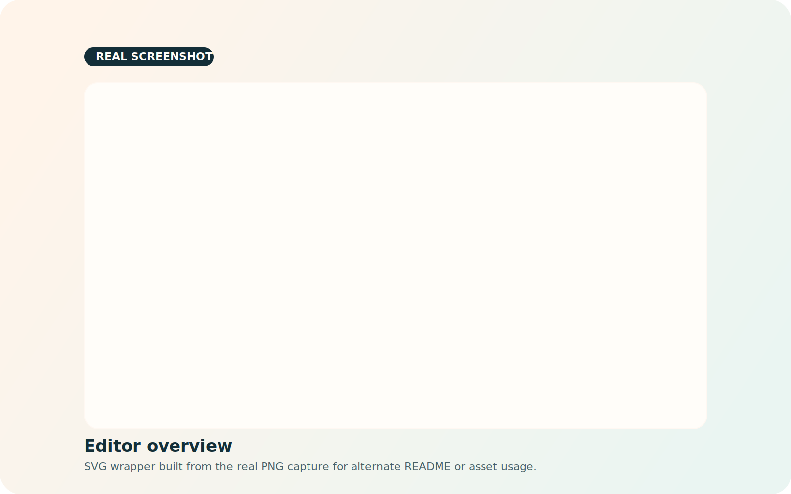
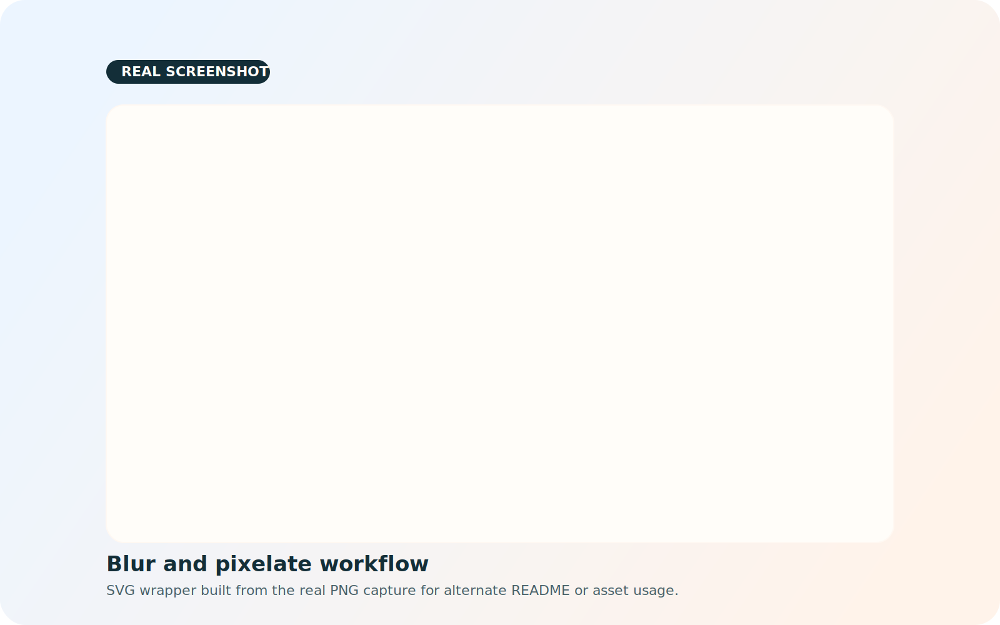
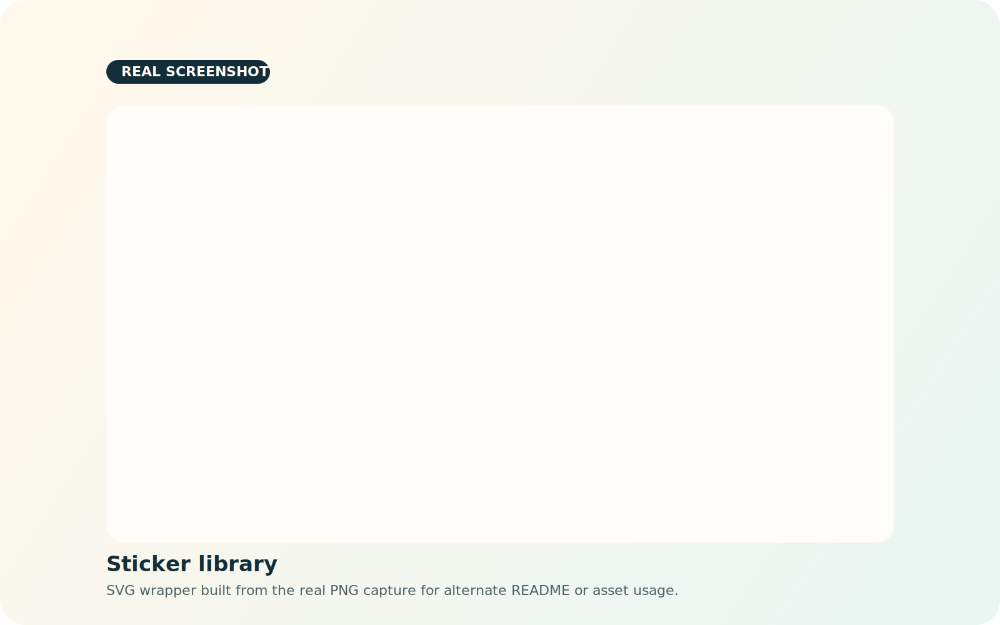

# Canvas Image Editor

A browser-based image editor built with Fabric.js lets you upload a base image, draw on top of it, add text and stickers, place extra image layers, apply blur or pixelate regions, and export the final composition as a PNG.

[Live Demo](https://eatsleepcodeloop.github.io/canvas-image-editor/) | [Source Code](https://github.com/eatsleepcodeloop/canvas-image-editor) | [Report Bug](https://github.com/eatsleepcodeloop/canvas-image-editor/issues)

## Why This Repo Exists

What this repo demonstrates:

- Feature extraction from a production codebase into a smaller standalone project
- Canvas editing workflows built with plain HTML, CSS, JavaScript, and Fabric.js
- UI state handling for drawing, text editing, layer management, and export flows
- Practical frontend refactoring with a deployment target that works on GitHub Pages

## Live Demo

Primary demo URL:

```text
https://eatsleepcodeloop.github.io/canvas-image-editor/
```

If GitHub Pages has not been enabled yet, that URL will stay unavailable until the repository is published from the `main` branch. Once Pages is live, this README does not need another structural update, only a quick link verification.

## Core Features

- Upload a base image and edit it directly in the browser
- Draw freehand with adjustable brush size and color
- Add editable text layers and a watermark layer
- Add extra image overlays on top of the base image
- Drop in stickers from the bundled emoji-style sticker pack
- Apply movable blur and pixelate effect regions
- Delete a selected layer or clear every editable overlay at once
- Export the finished composition as a high-resolution PNG

## Screenshots

### Editor Overview



### Blur And Pixelate Workflow



### Sticker Library



## Run Locally

This is a static frontend project, so you can either open the HTML file directly or serve the folder with any lightweight local server.

Open directly:

```text
index.html
```

Serve locally with a simple file server, then open the returned URL in your browser:

```bash
# example options
python -m http.server 8080
npx serve .
php -S localhost:8080
```

Recommended local URL:

```text
http://127.0.0.1:8080
```

## Publish To GitHub Pages

1. Push the project to the `main` branch of `eatsleepcodeloop/canvas-image-editor`.
2. In GitHub, open `Settings` -> `Pages`.
3. Set the deployment source to `Deploy from a branch`.
4. Choose `main` and `/ (root)`.
5. Save the settings and wait for the site to build.
6. Confirm the demo is reachable at `https://eatsleepcodeloop.github.io/canvas-image-editor/`.

## Tech Stack

- HTML
- CSS
- JavaScript
- [Fabric.js](https://fabricjs.com/)

## Suggested GitHub Metadata

Repository description:

```text
A browser-based canvas image editor built with Fabric.js, featuring drawing, text, stickers, blur and pixelate regions, layer controls, and PNG export.
```

Topics:

```text
canvas-editor, fabricjs, image-editor, javascript, frontend, webapp, github-pages, portfolio-project
```

## License

Use `MIT` if you want the project to be easy to share, fork, and reuse.
